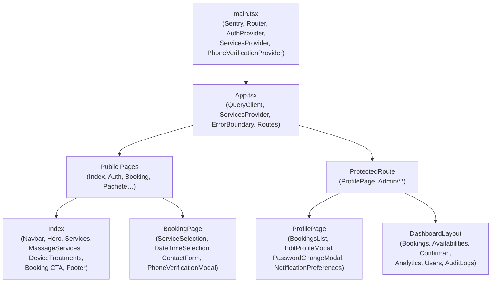
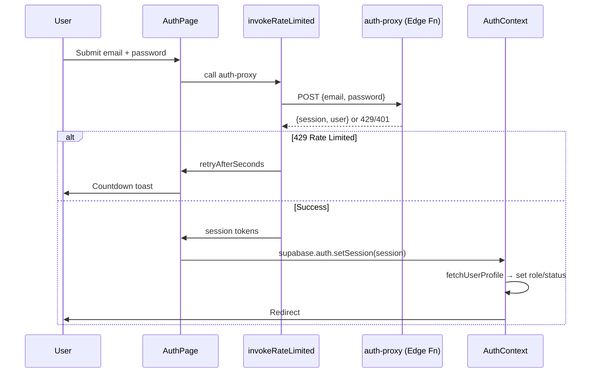

# Frontend Architecture

This document provides a comprehensive overview of the frontend architecture for **Masaj by Melinda**, covering technologies, design system, routing, components, contexts, and utility libraries.

---

## Technologies & Libraries

| Technology | Version | Purpose |
|---|---|---|
| **React** | 18 | UI construction and component management |
| **Vite** | 5 (SWC) | Fast build tool and dev server |
| **TypeScript** | 5 | Type safety and improved developer experience |
| **Tailwind CSS** | 3 | Utility-first styling framework |
| **shadcn/ui** | 0.8.0 | Prebuilt UI components built on Radix UI |
| **React Router DOM** | v6 | Client-side routing |
| **TanStack React Query** | v5 | Server state management and caching |
| **@sentry/react** | v10 | Error tracking and performance monitoring |
| **react-hook-form** | 7.53.0 | Form state management |
| **zod** | 3.23.8 | Schema validation |
| **date-fns** | 3.6.0 | Date manipulation and formatting |
| **lucide-react** | 0.462.0 | Modern React icon library |
| **sonner** | 1.5.0 | Toast notifications |
| **recharts** | 2.15.4 | Data visualization for analytics |
| **react-day-picker** | 8.10.1 | Calendar/date picker component |
| **input-otp** | 1.2.4 | OTP input component |
| **embla-carousel-react** | 8.3.0 | Carousel component |

---

## Design System & Colors

### Dark Theme
The application uses a **dark theme by default**:
- **Body background:** `bg-gray-900` (#111827)
- **Card backgrounds:** `bg-gray-800` (#1F2937)
- **Text:** Light gray and white for contrast

### Accent Color
- **Primary accent:** Violet — `#8b5cf6` / `violet-600`
- Used in: headings, spinners, buttons, email templates, active states

### CSS Variables
Defined in `src/index.css` using HSL tokens:
- `--background` — Main background color
- `--foreground` — Main text color
- `--primary` — Primary brand color
- `--primary-foreground` — Text on primary backgrounds
- `--accent` — Accent color for highlights
- `--card` — Card background color
- `--border` — Border color
- `--radius` — Border radius value

### Custom Scrollbar
Dark gray scrollbar styling:
- **Track:** `#1F2937` (gray-800)
- **Thumb:** `#4B5563` (gray-600)
- **Thumb hover:** `#6B7280` (gray-500)

### Tailwind Configuration
Custom configuration in `tailwind.config.ts`:
- **Custom animation:** `fade-in` (opacity 0 → 1, 200ms)
- **Sidebar color tokens:** Integrated with shadcn/ui theming
- **Border radius:** Controlled via `--radius` CSS variable

### shadcn/ui Components
All UI components live in `src/components/ui/`:
- Button, Input, Card, Dialog, DropdownMenu, Select, Textarea, Badge, Calendar, Checkbox, Label, Popover, RadioGroup, Separator, Sheet, Tabs, Toast, Toaster, etc.

---

## Application Entry Point

### `src/main.tsx`
The application entry point that:
1. **Initializes Sentry** (if `VITE_SENTRY_DSN` is set):
   - Uses `browserTracingIntegration` for navigation breadcrumbs
   - Configures `tracesSampleRate` (default 0.5) and `sampleRate` (default 1.0)
   - Includes `beforeSend` hook that **masks PII**:
     - Emails → `***@domain`
     - Phone numbers → `+40XXX***`
   - Ignores errors: `ResizeObserver`, `ChunkLoadError`, dynamic import failures
2. **Mounts React application** via `ReactDOM.createRoot`
3. **Wraps with providers:**
   - `<Router>` — React Router for client-side routing
   - `<AuthProvider>` — User session and authentication state
   - `<ServicesProvider>` — Active services list
   - `<PhoneVerificationProvider>` — OTP flow state management

### `src/App.tsx`
Defines all application routes and wraps them with:
- `<QueryClientProvider>` — TanStack React Query client
- `<ServicesProvider>` — Services context (nested)
- `<ErrorBoundary>` — Page-level error boundary

---

## Routing Table

| Path | Component | Auth Requirement |
|---|---|---|
| `/` | `Index` | Public |
| `/home` | `Index` | Public |
| `/auth` | `AuthPage` | Public |
| `/forgot-password` | `ForgotPasswordPage` | Public |
| `/reset-password` | `ResetPasswordPage` | Public |
| `/book` | `BookingPage` | Public |
| `/pachete` | `PachetePage` | Public |
| `/booking-confirmation` | `BookingConfirmationPage` | Public |
| `/profile` | `ProfilePage` | `customer` or `admin` |
| `/admin` | `DashboardLayout` | `admin` only |
| `/admin/bookings` | `Bookings` | `admin` only |
| `/admin/availabilities` | `Availabilities` | `admin` only |
| `/admin/analytics` | `Analytics` | `admin` only |
| `/admin/users` | `Users` | `admin` only |
| `/admin/auditlogs` | `AuditLogs` | `admin` only |
| `/admin/confirmari` | `Confirmari` | `admin` only |
| `/not-authorized` | `NotAuthorized` | Public |
| `*` | `NotFound` | Public |

---

## Page Descriptions

### `Index`
**Landing page** — Renders the public-facing homepage.

**Components:**
- `Navbar` — Navigation with smooth scrolling and mobile hamburger menu
- `Hero` — Hero section with CTA
- `Services` — Service overview
- `MassageServices` — Massage service catalog
- `DeviceTreatments` — Device treatment catalog
- `Booking` — CTA section encouraging users to book
- `Footer` — Footer with contact info and links

---

### `AuthPage`
**Login/register form** — Handles user authentication.

**Flow:**
1. User submits email + password
2. Calls `auth-proxy` edge function via `invokeRateLimited`
3. On **429 (rate limited):** Shows countdown toast
4. On **success:** Calls `supabase.auth.setSession` with returned tokens
5. `AuthContext` fetches user profile → sets role/status
6. Redirects to appropriate page

**Key features:**
- Rate limiting (5 requests per 4 minutes per email + IP)
- Error handling with Sentry integration
- Guest access option

---

### `BookingPage`
**Multi-step booking form** — Supports both authenticated users and guests.

**Steps:**
1. `BookingHeader` — Progress indicator
2. `ServiceSelection` — Choose massage service or device treatment
3. `DateTimeSelection` — Pick date and time (or provide free-text request)
4. `ContactForm` — Enter/confirm contact details

**Key features:**
- Real-time availability checks
- Free-text date/time requests (e.g., "luni dimineața")
- Phone verification modal (`PhoneVerificationModal`)
- Submits to `create-booking` edge function
- Handles rate limiting (10 bookings/hr per user + IP)

---

### `BookingConfirmationPage`
**Post-booking success page** — Displayed after successful booking submission.

**Content:**
- Confirmation message
- Booking details summary
- Instructions for what happens next

---

### `ProfilePage`
**Authenticated user dashboard** — Personal account management.

**Components:**
- `BookingsList` — Calendar view + list of past/upcoming bookings
- `EditProfileModal` — Edit personal details (name, email)
- `PasswordChangeModal` — Change account password
- `NotificationPreferences` — Customize which email notifications to receive

**Key features:**
- Real-time booking updates via `BookingsContext` subscription
- Cancel booking functionality
- View booking history

---

### `PachetePage`
**Static packages/pricing page** — Displays available service packages and pricing tiers.

---

### `ForgotPasswordPage` / `ResetPasswordPage`
**Password reset flow** — Allows users to reset forgotten passwords.

**Implementation:**
- Uses `src/services/auth/passwordReset.ts`
- `ForgotPasswordPage` — Request password reset email
- `ResetPasswordPage` — Confirm new password with token from email

---

### `AdminHome`
**Dashboard overview** — Admin landing page with summary statistics.

**Features:**
- Total bookings count
- Active users count
- Revenue metrics
- Recent activity

---

### `DashboardLayout`
**Admin sidebar layout** — Wraps all admin sub-pages with navigation sidebar.

**Navigation items:**
- Dashboard (AdminHome)
- Bookings
- Availabilities
- Confirmari (new)
- Analytics
- Users
- Audit Logs

---

### `Bookings`
**Bookings management page** — Full CRUD operations on bookings.

**Features:**
- Uses `BookingsContext` for state management
- Real-time subscription to `bookings` table
- `BookingFormModal` — Create new booking
- `EditBookingModal` — Edit existing booking
- Delete booking functionality
- Filter by status, date, service type

---

### `Availabilities`
**Availability management page** — Manage available/blocked time slots.

**Features:**
- Uses `AvailabilitiesContext` for state management
- Real-time subscription to `availabilities` table
- Create/edit/delete individual time slots
- **Recurring availabilities:** Create repeating blocked slots via `create-recurring-availabilities` edge function
- Calendar view of blocked times

---

### `Confirmari`
**Unconfirmed booking review page** — NEW admin page for reviewing booking requests.

**Features:**
- Lists all bookings with `status = 'unconfirmed'`
- Admin can:
  - **Confirm** → Status changes to `confirmed`
  - **Reject** → Status changes to `rejected`
  - **Suggest alternative** → Status changes to `suggested`, admin provides new date/time
- Triggers `booking-response` flow (customer receives email with action links)

---

### `Analytics`
**Analytics dashboard** — Visual charts for business insights.

**Charts (using recharts):**
- Booking trends over time (line chart)
- Popular services (bar chart)
- Peak booking hours (bar chart)
- Revenue by service type (pie chart)

---

### `Users`
**User management page** — Manage customer accounts.

**Features:**
- List all users with profile details
- **Ban/unban** users (sets `profiles.status`)
- **Delete** users (calls `delete-user` edge function)
  - Cascade deletes profile and bookings
  - Removes user from Supabase Auth

---

### `AuditLogs`
**Audit trail page** — Read-only view of admin actions.

**Features:**
- Reads from `admin_audit_logs` table
- Displays: timestamp, admin user, action type, target type/ID, details JSON
- Filterable by date range, admin user, action type

---

## Component Tree



---

## Contexts

### `AuthContext`
**File:** `src/contexts/AuthContext.tsx`

**Purpose:** Manages user session, authentication state, and role-based access.

**State:**
- `user` — Supabase Auth user object
- `profile` — User profile from `profiles` table
- `role` — User role (`admin` or `customer`)
- `status` — User account status (`active`, `banned`, etc.)
- `loading` — Authentication loading state

**Methods:**
- `signOut()` — Clears session and Sentry user context
- `refreshProfile()` — Re-fetches user profile from database

**Key features:**
- Sets Sentry user context after profile fetch (`id` + masked email)
- Listens to Supabase `auth.onAuthStateChange` for session changes
- Provides authentication state to entire app

---

### `BookingsContext`
**File:** `src/contexts/BookingsContext.tsx`

**Purpose:** Manages bookings state with CRUD operations and real-time updates.

**State:**
- `bookings` — Array of all bookings
- `loading` — Loading state
- `error` — Error state

**Methods:**
- `createBooking(booking)` — Create new booking
- `updateBooking(id, updates)` — Update existing booking
- `deleteBooking(id)` — Delete booking
- `refreshBookings()` — Re-fetch bookings from database

**Key features:**
- Real-time subscription to `bookings` table (listens to INSERT, UPDATE, DELETE)
- Automatic state updates on database changes
- Used by `ProfilePage`, `Bookings` admin page

---

### `ServicesContext`
**File:** `src/contexts/ServicesContext.tsx`

**Purpose:** Provides active services list from `services` table.

**State:**
- `services` — Array of active services
- `loading` — Loading state

**Methods:**
- `refreshServices()` — Re-fetch services from database

**Key features:**
- Filters to only show `is_active = true` services
- Used by `BookingPage` service selection step

---

### `AvailabilitiesContext`
**File:** `src/contexts/AvailabilitiesContext.tsx`

**Purpose:** Manages availabilities state with CRUD operations and real-time updates.

**State:**
- `availabilities` — Array of all availabilities
- `loading` — Loading state

**Methods:**
- `createAvailability(availability)` — Create new availability
- `updateAvailability(id, updates)` — Update existing availability
- `deleteAvailability(id)` — Delete availability
- `createRecurringAvailabilities(params)` — Create recurring blocked slots
- `refreshAvailabilities()` — Re-fetch availabilities

**Key features:**
- Real-time subscription to `availabilities` table
- Supports recurring availability creation
- Used by `Availabilities` admin page

---

### `PhoneVerificationContext`
**File:** `src/contexts/PhoneVerificationContext.tsx`

**Purpose:** Manages OTP phone verification flow state.

**State:**
- `isVerifying` — Whether verification modal is open
- `phoneNumber` — Phone number being verified
- `countdown` — Rate-limit countdown timer (seconds)
- `isRateLimited` — Whether user is rate-limited

**Methods:**
- `startVerification(phoneNumber)` — Open verification modal for given phone
- `completeVerification()` — Close modal after successful verification
- `cancelVerification()` — Close modal without verifying
- `setCountdown(seconds)` — Update countdown timer

**Key features:**
- 30-second throttle between OTP requests
- Rate-limit countdown toast notifications
- Integrates with `RateLimitManager` for frontend caching
- Used by `BookingPage` contact form

---

## Auth Flow



---

## Rate Limit Manager

**File:** `src/lib/rate-limit-manager.ts`

**Purpose:** Static class for managing rate-limit state in `sessionStorage`.

**Storage key prefix:** `rate_limit_`

**Methods:**
- `get(endpoint)` — Retrieve rate-limit state for endpoint
- `set(endpoint, state)` — Store rate-limit state with `until` timestamp
- `clear(endpoint)` — Remove rate-limit state
- `isLimited(endpoint)` — Check if currently rate-limited
- `getTimeRemaining(endpoint)` — Get seconds until rate limit expires
- `formatTimeRemaining(seconds)` — Format time as "Xm Ys" or "Xs"
- `updateFrom429Response(endpoint, retryAfterSeconds)` — Update state from 429 response
- `updateFromHeaders(endpoint, headers)` — Update state from `X-RateLimit-*` headers

**Used by:**
- `PhoneVerificationContext` — OTP request rate limiting
- `AuthPage` — Login rate limiting

**Key features:**
- Prevents redundant API calls when rate-limited
- Automatically expires stale entries
- Provides formatted countdown strings for UI

---

## `invokeRateLimited`

**File:** `src/lib/supabase-functions.ts`

**Purpose:** Wrapper around `supabase.functions.invoke` with rate-limit handling and Sentry integration.

**Signature:**
```typescript
invokeRateLimited<T>(
  functionName: string,
  options?: FunctionInvokeOptions
): Promise<FunctionResponse<T>>
```

**Behavior:**
1. Calls `supabase.functions.invoke`
2. On **429 (rate limited):**
   - Calls `RateLimitManager.updateFrom429Response`
   - Throws error with `retryAfterSeconds`
3. On **other errors:**
   - Calls `Sentry.captureMessage` (validation errors)
   - Calls `Sentry.captureException` (unexpected errors)
   - Tags: `layer: 'frontend'`, `endpoint: <function-name>`, `feature: <inferred>`
4. Returns response

**Used by:**
- All edge function calls throughout the frontend
- `AuthPage`, `BookingPage`, `ProfilePage`, admin pages

---

## Middleware / Route Protection

**File:** `src/components/ProtectedRoute.tsx`

**Purpose:** Wrapper component that enforces authentication and role-based access control.

**Props:**
- `children` — React components to render if authorized
- `allowedRoles` — Array of allowed roles (`['admin']` or `['customer', 'admin']`)

**Behavior:**
1. Checks `useAuth()` for current user
2. If **unauthenticated** → Redirect to `/auth`
3. If **authenticated but unauthorized** → Redirect to `/not-authorized`
4. If **authorized** → Render children

**Usage:**
- Wraps `/profile` (customer or admin)
- Wraps all `/admin/*` routes (admin only)

---

## Error Boundaries

### Page-Level Error Boundary
**File:** `src/components/ErrorBoundary.tsx`

**Purpose:** Catches React errors at page level and displays fallback UI.

**Features:**
- Wraps all routes in `App.tsx`
- Displays friendly error message to user
- Integrates with Sentry (errors automatically captured by Sentry React integration)
- Provides "Reset" button to clear error state

---

### Form-Level Error Boundary
**File:** `src/components/FormErrorBoundary.tsx`

**Purpose:** Catches errors in critical forms without crashing entire page.

**Features:**
- Wraps booking form, authentication form, and other critical forms
- Displays inline error message
- User can continue using rest of application

---

## Utility Libraries

### `src/lib/booking-utils.ts`
**Booking-related utilities**

**Key functions:**
- `getTimeSlots()` — Returns available time slots:
  - **Monday–Friday:** 8:00–20:00
  - **Saturday:** 8:00–12:00
  - **Sunday:** Closed
- `isValidDate(date)` — Check if date is valid for booking (not past, not Sunday)
- `fetchBookedTimeSlots(date)` — Queries both `bookings` and `recurring_bookings` tables for given date
- `generateBookingResponseToken()` — Generate unique token for booking response emails
- `validateBookingResponseToken(token)` — Validate token format and expiration

---

### `src/lib/audit-logger.ts`
**Admin action logging**

**Key function:**
- `logAdminAction(action, targetType, targetId, details)` — Writes to `admin_audit_logs` table
  - Example: `logAdminAction('DELETE_USER', 'user', userId, { email: user.email })`

**Used by:**
- All admin pages that perform sensitive operations
- User management, booking edits, availability changes

---

### `src/lib/utils.ts`
**General utilities**

**Key function:**
- `cn(...classes)` — Combines `clsx` + `tailwind-merge` for conditional className composition
  - Example: `cn('text-lg', isActive && 'font-bold')`

---

## Related Documentation

- **[BACKEND.MD](BACKEND.MD)** — Backend architecture, database schema, edge functions
- **[IMPLEMENTATIONS.MD](IMPLEMENTATIONS.MD)** — Third-party integrations (Brevo, Twilio, Sentry, Upstash Redis)
- **[docs/DEPLOYMENT.md](docs/DEPLOYMENT.md)** — Deployment guide
- **[docs/SECURITY.md](docs/SECURITY.md)** — Security policies

---

**Last Updated:** Saturday Feb 21, 2026
