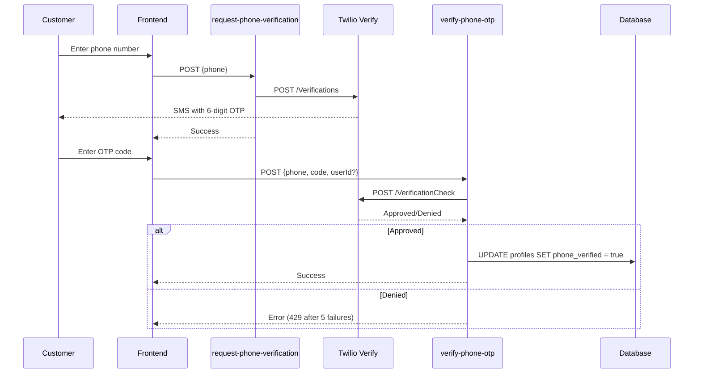

# Third-Party Integrations

This document provides comprehensive documentation for all third-party service integrations used in **Masaj by Melinda**, covering email delivery, SMS/OTP, deployment, error tracking, and rate limiting.

---

## Brevo (Email)

### Role
**Transactional email delivery service** for booking confirmations, reminders, password resets, and admin notifications.

### Integration Point

**Backend:** `supabase/functions/send-email/index.ts`
- Calls `https://api.brevo.com/v3/smtp/email`
- Uses `api-key` header for authentication
- Sends HTML + plain text versions

**Frontend:** `src/services/notifications/emailService.ts`
- 18 email templates (Romanian HTML + plain text)
- Calls `send-email` edge function via `invokeRateLimited`
- All templates use violet accent color (`#8b5cf6`)

### Email Templates (18 Total)

| Template | Trigger | Recipient | Key Content |
|---|---|---|---|
| **Booking Created (Customer)** | `create-booking` succeeds | Customer | Booking details, date/time, service name |
| **Booking Created (Admin)** | `create-booking` succeeds | Admin | New booking alert with customer details |
| **Booking Updated (Customer)** | Admin edits booking | Customer | Updated booking details |
| **Booking Updated (Admin)** | Admin edits booking | Admin | Confirmation of changes made |
| **Booking Cancelled (Customer)** | Customer/admin cancels | Customer | Cancellation confirmation |
| **Booking Cancelled (Admin)** | Customer/admin cancels | Admin | Notification of cancellation |
| **Recurring Enabled (Customer)** | `create-recurring-bookings` | Customer | Recurring schedule details |
| **Recurring Cancelled (Customer)** | `cancel-recurring-bookings` | Customer | Cancellation confirmation |
| **Reminder** | `send-reminders` cron (daily) | Customer | Appointment reminder for next day |
| **Password Changed** | Password update succeeds | Customer | Security notification |
| **Password Reset** | `ForgotPasswordPage` flow | Customer | Reset link with token |
| **Booking Approval Needed** | Admin creates booking | Customer | Unconfirmed booking notice |
| **Admin Confirmed** | Admin confirms on `Confirmari` | Customer | Booking confirmed notification |
| **Admin Rejected** | Admin rejects on `Confirmari` | Customer | Booking rejected with reason |
| **Admin Suggested** | Admin suggests alternative | Customer | New date/time suggestion with accept/decline links |
| **Suggestion Accepted** | Customer accepts via `booking-response` | Admin | Customer accepted suggestion |
| **Suggestion Declined** | Customer declines via `booking-response` | Admin | Customer declined, needs follow-up |
| **Test Email** | `send-test-emails` function | Developers | Round-robin test with all templates |

### Sender Configuration

**Backend Secrets:**
- `BREVO_API_KEY` — Brevo API authentication key
- `BREVO_FROM_EMAIL` — Sender email address (e.g., `noreply@masajbymelinda.ro`)
- `BREVO_FROM_NAME` — Sender display name (e.g., `Masaj by Melinda`)

**Frontend Environment Variables (Config Validation Only):**
- `VITE_BREVO_API_KEY` — Used only by `src/lib/config.ts` for `isEmailConfigured()` check
- `VITE_BREVO_FROM_EMAIL` — Config validation
- `VITE_BREVO_FROM_NAME` — Config validation

**Note:** Frontend variables are NOT used for actual email sending (only backend secrets are used).

### Rate Limits
- **10 emails/hr per recipient** — Prevents spam to individual users
- **50 emails/hr per IP** — Prevents abuse from single source
- Enforced in `send-email` edge function via Upstash Redis

### Reminder Cron Job

**Function:** `send-reminders`  
**Schedule:** Daily at midnight (Europe/Bucharest timezone)

**Flow:**
1. Query `bookings` for next day with `status = 'confirmed'`
2. For each booking:
   - Fetch user's `notification_preferences`
   - If `reminder_enabled = true`: Send reminder email
3. Log sent count

**Template:** Includes booking details, service name, date/time, location info

---

## Twilio (SMS + OTP)

### Role
**SMS notifications** to admins and **OTP phone verification** via Twilio Verify for customer accounts.

---

### OTP Flow (Twilio Verify)

**Purpose:** Verify customer phone numbers before allowing bookings.

**Functions:**
1. `request-phone-verification` → Twilio Verify API (`/Verifications`)
2. `verify-phone-otp` → Twilio Verify API (`/VerificationCheck`)

**Flow:**



**On success:**
- Updates `profiles.phone_verified = true`
- Sets `profiles.phone_verified_at = NOW()`

---

### Admin SMS (Twilio Messages)

**Purpose:** Instant SMS alerts to admin(s) when new booking is created.

**Integration:** `create-booking` edge function calls Twilio Messages API directly.

**Flow:**
1. `create-booking` succeeds
2. Read `ADMIN_PHONE_NUMBERS` secret (comma-separated list)
3. For each admin phone:
   - Call Twilio Messages API (`/Messages`)
   - Send Romanian SMS with booking details
4. All SMS failures logged silently (non-blocking)

**Why direct API call:** Faster than calling `send-sms` edge function (avoids extra hop).

---

### Frontend SMS Service

**File:** `src/services/notifications/smsService.ts`

**Purpose:** 11 SMS templates (Romanian) for various notifications.

**Templates:**
1. Booking created (customer)
2. Booking updated (customer)
3. Booking cancelled (customer)
4. Booking created (admin)
5. Booking updated (admin)
6. Booking cancelled (admin)
7. Recurring enabled (customer)
8. Recurring cancelled (customer)
9. Admin confirmed (customer)
10. Admin rejected (customer)
11. Admin suggested alternative (customer)

**Usage:** Calls `send-sms` edge function via `invokeRateLimited`.

---

### Secrets

**Backend (Supabase Secrets):**
- `TWILIO_SID` — Twilio Account SID
- `TWILIO_AUTH_TOKEN` — Twilio Auth Token
- `TWILIO_VERIFY_SID` — Twilio Verify Service SID (for OTP)
- `TWILIO_PHONE_NUMBER` — Twilio phone number (for sending SMS)
- `ADMIN_PHONE_NUMBERS` — Comma-separated list of admin phones (e.g., `+40712345678,+40723456789`)

**Frontend (Config Validation Only):**
- `VITE_TWILIO_SID` — Used only by `src/lib/config.ts` for `isSmsConfigured()` check
- `VITE_TWILIO_AUTH_TOKEN` — Config validation

---

### Rate Limits

| Endpoint | Limit | Window | Fail Mode |
|---|---|---|---|
| OTP Request (per phone) | 3 | 5 min | **Fail-closed** (503 if Redis down) |
| OTP Request (per IP) | 5 | 5 min | **Fail-closed** |
| OTP Verify (per phone) | 5 | 15 min | **Fail-closed** |
| OTP Verify (per IP) | 15 | 15 min | **Fail-closed** |
| SMS Send (per phone) | 5 | 1 hr | Fail-open |
| SMS Send (per IP) | 20 | 1 hr | Fail-open |

**Rationale for fail-closed:** Prevents OTP spam attacks if rate-limiting infrastructure fails.

---

### Escalating Lockout

**After 5 failed OTP verification attempts:**
- Phone number is locked for **15 minutes**
- IP address is locked for **15 minutes**
- Tracked in Upstash Redis:
  - `otp:lockout:phone:{phone}` (String, Unix ms expiry)
  - `otp:lockout:ip:{ip}` (String, Unix ms expiry)
  - `otp:failures:phone:{phone}` (Sorted Set, timestamp scores)
  - `otp:failures:ip:{ip}` (Sorted Set, timestamp scores)

**Why:** Prevents brute-force OTP guessing attacks.

---

## Vercel (Deployment)

### Role
**Hosting platform** for the React SPA (single-page application).

**Scope:** Frontend only — Supabase edge functions run on Supabase infrastructure, NOT Vercel.

---

### Configuration

**File:** `vercel.json`

**Custom Routes:**
```json
{
  "routes": [
    {
      "src": "/assets/(.*)",
      "dest": "/assets/$1"
    },
    {
      "src": "/(.*)",
      "dest": "/index.html"
    }
  ]
}
```

**Purpose:**
- Serve static assets directly from `/assets/`
- Fall back all other paths to `/index.html` (enables client-side routing)

---

### Build Configuration

**Build Command:** `vite build`

**Output Directory:** `dist/`

**Node Version:** `20.x` (specified in `package.json` `engines` field)

**Memory:** `NODE_OPTIONS=--max-old-space-size=4096` (set in Vercel project settings for large builds)

---

### Environment Variables

**All `VITE_*` variables must be set in Vercel project settings:**
- `VITE_SUPABASE_URL`
- `VITE_SUPABASE_ANON_KEY`
- `VITE_SENTRY_DSN` (optional)
- `VITE_SENTRY_ENVIRONMENT`
- `VITE_SENTRY_SAMPLE_RATE`
- `VITE_SENTRY_ERROR_SAMPLE_RATE`
- `VITE_BREVO_API_KEY` (config validation only)
- `VITE_BREVO_FROM_EMAIL` (config validation only)
- `VITE_BREVO_FROM_NAME` (config validation only)
- `VITE_TWILIO_SID` (config validation only)
- `VITE_TWILIO_AUTH_TOKEN` (config validation only)

**Why:** Vite inlines environment variables at build time (not runtime).

---

### Backend Note

**Supabase edge functions are NOT deployed to Vercel.**

They run on Supabase's Deno infrastructure and are accessed via:
- `https://<project-ref>.supabase.co/functions/v1/<function-name>`

The frontend calls these endpoints using `supabase.functions.invoke()`.

---

## Sentry (Error Tracking)

### Role
**Real-time error and exception tracking** for both frontend and backend.

---

### Frontend (`@sentry/react` v10)

**Initialization:** `src/main.tsx` (before React render)

**Configuration:**
- **DSN:** `VITE_SENTRY_DSN` (required to enable Sentry)
- **Environment:** `VITE_SENTRY_ENVIRONMENT` (e.g., `production`, `staging`)
- **Trace Sample Rate:** `VITE_SENTRY_SAMPLE_RATE` (default: `0.5` = 50%)
- **Error Sample Rate:** `VITE_SENTRY_ERROR_SAMPLE_RATE` (default: `1.0` = 100%)

**Integration:**
- `browserTracingIntegration` — Captures navigation breadcrumbs for debugging

**PII Sanitization (`beforeSend` hook):**
- **Emails:** Masked to `***@domain` (e.g., `user@example.com` → `***@example.com`)
- **Phone numbers:** Masked to `+40XXX***` (e.g., `+40712345678` → `+40XXX***`)

**Ignored Errors:**
- `ResizeObserver loop limit exceeded`
- `ChunkLoadError`
- Dynamic import failures (network issues during code splitting)

**User Context:**
Set in `AuthContext` after profile fetch:
```typescript
Sentry.setUser({
  id: profile.id,
  email: maskEmail(profile.email)
});
```

Cleared on sign-out:
```typescript
Sentry.setUser(null);
```

**Manual Capture:**
`src/lib/supabase-functions.ts` captures errors from edge function calls:
- `Sentry.captureMessage` — For validation errors (4xx responses)
- `Sentry.captureException` — For unexpected errors (5xx responses, network failures)
- **Tags:**
  - `layer: 'frontend'`
  - `endpoint: <function-name>`
  - `feature: <auth|booking|profile|admin>`

---

### Backend (HTTP Store API — No SDK)

**Implementation:** `supabase/functions/_shared/sentry.ts`

**Why no SDK:** Deno edge functions have limited package support; HTTP Store API is more compatible.

**Configuration:**
- **DSN:** `SENTRY_DSN` (Supabase secret)
- **Environment:** `SENTRY_ENVIRONMENT` (Supabase secret)

**Functions:**
- `captureException(error, context?)` — Report exception to Sentry
- `captureMessage(message, level, context?)` — Report message to Sentry
- `isCriticalError(error)` — Check if error matches critical keywords

**Critical Error Keywords:**
- `redis`, `upstash`, `database`, `twilio`, `pgrst`, `connection`, `timeout`, `service role`

**PII Sanitization:**
- **IP addresses:** Last octet masked (e.g., `192.168.1.100` → `192.168.1.***`)
- **Emails:** Masked to `***@domain`

**Integration Points:**

1. **Middleware catch block** (`supabase/functions/_shared/middleware.ts`):
   - Captures critical errors only
   - Tags: `layer: 'backend'`, `function: <edge-fn-name>`, `severity: critical`

2. **Rate limit failures** (`rateLimitMiddleware`):
   - Captures Redis connection failures
   - Tags: `feature: rate-limit`, `severity: critical`

3. **Individual edge functions:**
   - `auth-proxy` — Login failures
   - `create-booking` — Booking creation failures, notification failures
   - `request-phone-verification` — Twilio API failures
   - `verify-phone-otp` — Twilio API failures, escalating lockout triggers

**Tags:**
- `layer: 'backend'`
- `function: <edge-fn-name>`
- `feature: <auth|booking|otp|rate-limit|notification>`
- `severity: <critical|warning>`

**Fire-and-Forget:**
All Sentry calls use non-blocking `fetch` (no `await`) to avoid impacting response times.

---

### Single Sentry Project

**Both frontend and backend report to the SAME Sentry project.**

**Why:** Simplified management, unified error dashboard.

**Differentiation:** Events are distinguished by the `layer` tag:
- `layer: 'frontend'` — React app errors
- `layer: 'backend'` — Edge function errors

**Search Examples:**
- `layer:frontend feature:auth` — Frontend auth errors
- `layer:backend severity:critical` — Critical backend errors
- `endpoint:create-booking` — All create-booking errors

---

## Upstash Redis (Rate Limiting)

### Role
**Distributed, persistent rate-limit state** across stateless edge function invocations.

**Why Redis:** Edge functions are stateless; in-memory rate limiting doesn't work across invocations. Redis provides shared state.

---

### Client

**Packages:**
- `@upstash/redis` v1.28.0 — REST API client (serverless-compatible)
- `@upstash/ratelimit` v2.0.8 — Rate-limiting algorithms

**Connection:**
- **REST API (not TCP)** — Required for serverless/Deno compatibility
- **Credentials:**
  - `UPSTASH_REDIS_REST_URL` (Supabase secret)
  - `UPSTASH_REDIS_REST_TOKEN` (Supabase secret)

**Import Map:** Configured in `supabase/functions/deno.json`

---

### Algorithms

#### 1. Sliding Window (Most Endpoints)
**Implementation:** `@upstash/ratelimit` `Ratelimit.slidingWindow`

**Behavior:**
- Tracks requests over rolling time window
- Example: "5 requests per 4 minutes" — allows 5 requests in any 4-minute period

**Usage:**
- Auth proxy (5/4min per email + IP)
- Booking creation (10/hr per user + IP)
- Email sending (10/hr per recipient + 50/hr per IP)
- SMS sending (5/hr per phone + 20/hr per IP)
- OTP requests (3/5min per phone + 5/5min per IP)
- Global IP (100/min)

**Instances:** Cached in module-level `Map` for warm invocation reuse.

---

#### 2. Token Bucket (OTP Verification)
**Implementation:** Custom Lua script via `redis.eval`

**Behavior:**
- Tokens refill at constant rate
- Allows bursts (e.g., 5 requests in quick succession)
- Sustained abuse limited by refill rate

**Usage:**
- OTP verification (5 attempts per 15 min per phone)

**Rationale:** Allows legitimate users to retry OTP multiple times quickly (typos), but prevents sustained brute-force attacks.

**Redis Keys:**
- `tokenbucket:{endpoint}:{identifier}` (Hash)
  - Fields: `tokens`, `last_refill`

---

#### 3. Fixed Window (Admin Actions)
**Implementation:** Redis `INCR` + `EXPIRE`

**Behavior:**
- Resets counter at fixed intervals
- Simpler than sliding window
- Potential for burst at window boundaries

**Usage:**
- Admin actions (delete user, create/cancel recurring availabilities)

**Redis Keys:**
- `fixedwindow:{endpoint}:{identifier}:{window}` (String counter)

---

### Key Patterns

| Pattern | Purpose | Data Type |
|---|---|---|
| `ratelimit:{endpoint}:{identifier}` | Sliding window (managed by `@upstash/ratelimit`) | Internal |
| `tokenbucket:{endpoint}:{identifier}` | Token bucket state | Hash (`tokens`, `last_refill`) |
| `fixedwindow:{endpoint}:{identifier}:{window}` | Fixed window counter | String (integer) |
| `otp:lockout:phone:{phone}` | OTP lockout (phone) | String (Unix ms expiry) |
| `otp:lockout:ip:{ip}` | OTP lockout (IP) | String (Unix ms expiry) |
| `otp:failures:phone:{phone}` | OTP failure tracking (phone) | Sorted Set (timestamp scores) |
| `otp:failures:ip:{ip}` | OTP failure tracking (IP) | Sorted Set (timestamp scores) |

---

### Fail Modes

**Fail-Closed (OTP Endpoints):**
- If Redis is unavailable: Return **503 Service Unavailable**
- **Why:** Prevents OTP spam attacks if rate-limiting infrastructure fails

**Endpoints:**
- `request-phone-verification`
- `verify-phone-otp`

**Fail-Open (All Other Endpoints):**
- If Redis is unavailable: **Allow request** (log error to Sentry)
- **Why:** Prefer availability over strict rate limiting for non-critical endpoints

**Endpoints:**
- `auth-proxy`, `create-booking`, `booking-response`, `send-email`, `send-sms`, etc.

---

### Diagnostic Function

**Function:** `rate-limit-health`

**Purpose:** Test Upstash connectivity and all 3 rate-limit algorithms.

**Flow:**
1. Test Redis PING
2. Test sliding window rate limit (dummy identifier)
3. Test token bucket rate limit (dummy identifier)
4. Test fixed window rate limit (dummy identifier)
5. Return JSON health report:
   ```json
   {
     "status": "healthy",
     "ping": "OK",
     "slidingWindow": { "success": true, "limit": 5, "remaining": 4, "reset": 1234567890 },
     "tokenBucket": { "success": true, "tokens": 5 },
     "fixedWindow": { "success": true, "count": 1 },
     "timing": { "total": 123, "ping": 10, "slidingWindow": 45, ... }
   }
   ```

**Usage:** DevOps monitoring, debugging rate-limit issues.

---

### Frontend Caching

**File:** `src/lib/rate-limit-manager.ts`

**Purpose:** Cache 429 rate-limit state in `sessionStorage` to avoid redundant API calls.

**Storage Key Prefix:** `rate_limit_`

**Behavior:**
1. On **429 response:** Store `{until: timestamp}` in `sessionStorage`
2. Before API call: Check if currently rate-limited via `isLimited(endpoint)`
3. If rate-limited: Show countdown toast instead of making API call
4. On **success response:** Clear rate-limit state via `clear(endpoint)`

**Why:** Reduces unnecessary API calls and provides better UX (countdown timer).

**Auto-expiry:** `isLimited()` checks if `until` timestamp has passed (stale entries ignored).

---

## Related Documentation

- **[README.md](README.md)** — Project overview and setup
- **[FRONTEND.MD](FRONTEND.MD)** — Frontend architecture, component tree, routing
- **[BACKEND.MD](BACKEND.MD)** — Backend architecture, database schema, edge functions
- **[docs/DEPLOYMENT.md](docs/DEPLOYMENT.md)** — Deployment guide
- **[docs/SECURITY.md](docs/SECURITY.md)** — Security policies

---

**Last Updated:** Saturday Feb 21, 2026
