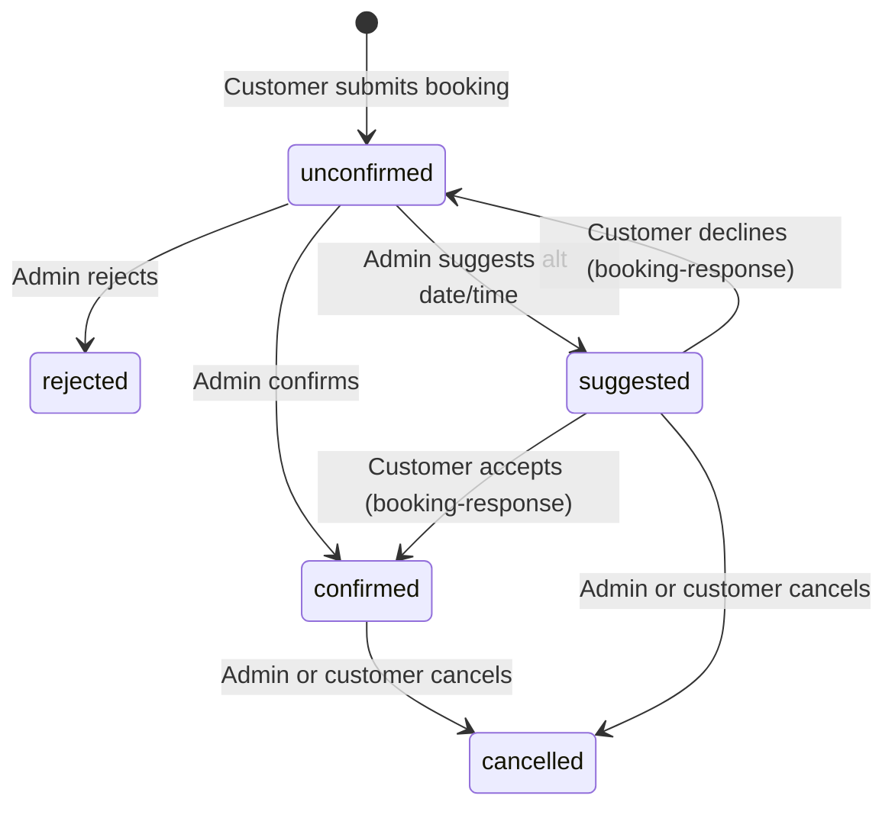
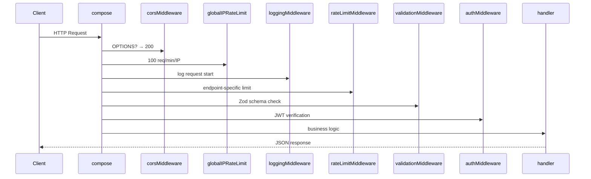
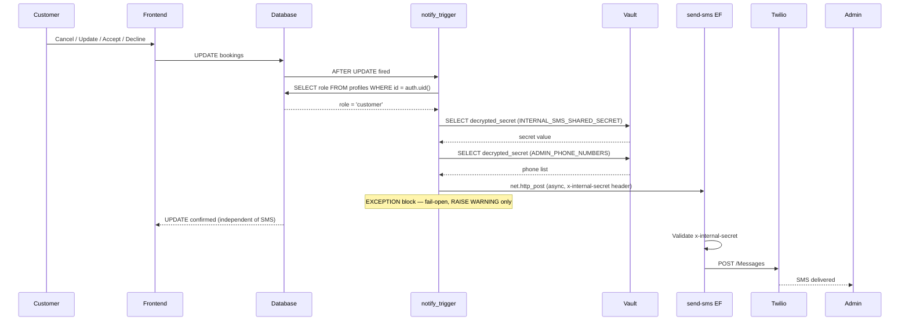

# Backend Architecture

This document provides a comprehensive overview of the backend architecture for **Masaj by Melinda**, covering the serverless architecture, database schema, edge functions, middleware, rate limiting, and security policies.

---

## Overview

The backend is **entirely serverless**, built on **Supabase** infrastructure:
- **Database:** PostgreSQL (managed by Supabase)
- **Authentication:** Supabase Auth (JWT-based)
- **Backend Logic:** Edge Functions (Deno runtime, serverless)
- **No traditional server** — All business logic lives in stateless edge functions

**Key characteristics:**
- Stateless request handling
- Distributed rate limiting via Upstash Redis
- Row Level Security (RLS) for data protection
- Real-time subscriptions via Supabase Realtime
- Serverless cron jobs for scheduled tasks

---

## Database Tables

### `profiles`
**Purpose:** User profiles and account information

**Key Columns:**
- `id` (UUID, PK) — Foreign key to `auth.users.id`
- `role` (TEXT) — User role: `customer` or `admin`
- `status` (TEXT) — Account status: `active`, `banned`, etc.
- `first_name`, `last_name` (TEXT) — User name
- `email` (TEXT) — User email (synced with auth.users)
- `phone` (TEXT) — Phone number
- `phone_verified` (BOOLEAN) — Whether phone is verified via OTP
- `phone_verified_at` (TIMESTAMP) — When phone was verified
- `created_at`, `updated_at` (TIMESTAMP)

**Relationships:**
- One-to-many with `bookings` (user_id FK)
- One-to-one with `notification_preferences` (user_id FK)

---

### `bookings`
**Purpose:** All customer booking records

**Key Columns:**
- `id` (UUID, PK)
- `user_id` (UUID, FK to profiles) — NULL for guest bookings
- `first_name`, `last_name`, `email`, `phone_number` (TEXT) — Contact info (required even for authenticated users)
- `service_type` (TEXT) — `massage` or `device`
- `service_id` (UUID, FK to services)
- `booking_date` (DATE, NULLABLE) — Structured date (NULL if free-text request)
- `booking_time` (TIME, NULLABLE) — Structured time (NULL if free-text request)
- `requested_date_text` (TEXT, NULLABLE) — Free-text date request (e.g., "luni dimineața")
- `requested_time_text` (TEXT, NULLABLE) — Free-text time request
- `status` (booking_status ENUM) — `unconfirmed`, `confirmed`, `rejected`, `suggested`, `cancelled`
- `recurring` (BOOLEAN) — Whether this is a recurring booking
- `suggested_date` (DATE, NULLABLE) — Admin's suggested alternative date
- `suggested_time` (TIME, NULLABLE) — Admin's suggested alternative time
- `suggested_by_admin` (BOOLEAN) — Whether admin has suggested alternatives
- `created_at`, `updated_at` (TIMESTAMP)

**Relationships:**
- Many-to-one with `profiles` (user_id FK)
- Many-to-one with `services` (service_id FK)
- One-to-many with `recurring_bookings` (booking_id FK)
- One-to-many with `booking_response_tokens` (booking_id FK)

---

### `availabilities`
**Purpose:** Admin-managed time slots (available or blocked)

**Key Columns:**
- `id` (UUID, PK)
- `date` (DATE) — Availability date
- `hour` (INTEGER) — Hour of the day (0-23)
- `is_available` (BOOLEAN) — TRUE if available, FALSE if blocked
- `recurring_availability_id` (UUID, FK to recurring_availabilities, NULLABLE) — Parent recurring availability
- `created_at`, `updated_at` (TIMESTAMP)

**Relationships:**
- Many-to-one with `recurring_availabilities` (recurring_availability_id FK)

---

### `recurring_bookings`
**Purpose:** Individual instances of recurring bookings

**Key Columns:**
- `id` (UUID, PK)
- `booking_id` (UUID, FK to bookings) — Parent booking
- `recurrence_type` (TEXT) — `weekly` or `biweekly`
- `until` (DATE) — End date of recurrence
- `day` (TEXT) — Day of week (e.g., "Monday")
- `hour` (INTEGER) — Hour of the day (0-23)
- `date` (DATE) — Specific instance date
- `status` (TEXT) — Instance status: `pending`, `confirmed`, `cancelled`
- `created_at` (TIMESTAMP)

**Relationships:**
- Many-to-one with `bookings` (booking_id FK)

---

### `recurring_availabilities`
**Purpose:** Parent records for recurring blocked time slots

**Key Columns:**
- `id` (UUID, PK)
- `recurrence_type` (TEXT) — `weekly`, `biweekly`, or `monthly`
- `weekdays` (TEXT ARRAY) — Days of week (e.g., `['Monday', 'Wednesday']`)
- `hour` (INTEGER) — Hour of the day (0-23)
- `start_date` (DATE) — Recurrence start date
- `until` (DATE) — Recurrence end date
- `created_at` (TIMESTAMP)

**Relationships:**
- One-to-many with `availabilities` (recurring_availability_id FK)

---

### `services`
**Purpose:** Service catalog (massage services and device treatments)

**Key Columns:**
- `id` (UUID, PK)
- `name` (TEXT) — Service name
- `description` (TEXT) — Service description
- `duration` (INTEGER) — Duration in minutes
- `price` (NUMERIC) — Service price
- `is_active` (BOOLEAN) — Whether service is currently offered
- `created_at`, `updated_at` (TIMESTAMP)

**Relationships:**
- One-to-many with `bookings` (service_id FK)

---

### `booking_response_tokens`
**Purpose:** One-time tokens for email-based booking responses

**Key Columns:**
- `id` (UUID, PK)
- `booking_id` (UUID, FK to bookings) — Associated booking
- `token` (TEXT, UNIQUE) — Unique token (UUID)
- `expires_at` (TIMESTAMP) — Token expiration time
- `used_at` (TIMESTAMP, NULLABLE) — When token was used
- `created_at` (TIMESTAMP)

**Relationships:**
- Many-to-one with `bookings` (booking_id FK)

**Security:**
- Tokens expire after 7 days
- Single-use only (marked with `used_at` timestamp)
- Service role access only (no RLS policies for client access)

---

### `otp_verifications`
**Purpose:** OTP attempt tracking for phone verification

**Key Columns:**
- `id` (UUID, PK)
- `user_id` (UUID, FK to profiles, NULLABLE) — Associated user (NULL for guest)
- `phone` (TEXT) — Phone number being verified
- `otp_hash` (TEXT) — Hashed OTP code
- `expires_at` (TIMESTAMP) — OTP expiration time
- `created_at` (TIMESTAMP)

**Relationships:**
- Many-to-one with `profiles` (user_id FK)

**Security:**
- OTP codes are hashed before storage
- Expire after 10 minutes
- RLS: owner or service role only

---

### `notification_preferences`
**Purpose:** Per-user notification settings

**Key Columns:**
- `user_id` (UUID, PK, FK to profiles)
- `booking_creation_enabled` (BOOLEAN) — Email on booking creation
- `booking_update_enabled` (BOOLEAN) — Email on booking update
- `booking_cancellation_enabled` (BOOLEAN) — Email on booking cancellation
- `reminder_enabled` (BOOLEAN) — Email reminder for upcoming bookings
- `created_at`, `updated_at` (TIMESTAMP)

**Relationships:**
- One-to-one with `profiles` (user_id FK)

---

### `admin_audit_logs`
**Purpose:** Audit trail of admin actions

**Key Columns:**
- `id` (UUID, PK)
- `user_id` (UUID, FK to profiles) — Admin who performed action
- `action` (TEXT) — Action type (e.g., `DELETE_USER`, `BAN_USER`, `UPDATE_BOOKING`)
- `target_type` (TEXT) — Type of target (e.g., `user`, `booking`)
- `target_id` (UUID) — ID of target record
- `details` (JSONB) — Additional action details
- `created_at` (TIMESTAMP)

**Relationships:**
- Many-to-one with `profiles` (user_id FK)

**Security:**
- Admin access only (RLS enforced)
- Immutable (no UPDATE/DELETE policies)

---

### `test_email_state`
**Purpose:** Round-robin test email state tracking

**Key Columns:**
- `id` (INTEGER, PK)
- `last_sent_index` (INTEGER) — Index of last recipient in test list
- `updated_at` (TIMESTAMP)

**Security:**
- Service role only (no RLS policies)

---

## Booking Status Lifecycle



---

## Database Migrations (Chronological)

| Migration File | Changes |
|---|---|
| `20240729120000_phone_verification.sql` | Adds `phone_verified`, `phone_verified_at` columns to `profiles`; creates `otp_verifications` table |
| `20250101_add_booking_status.sql` | Creates `booking_status` enum type; adds `status`, `suggested_date`, `suggested_time`, `suggested_by_admin` columns to `bookings` |
| `20250102_booking_response_tokens.sql` | Creates `booking_response_tokens` table |
| `20250203_add_booking_text_requests.sql` | Adds `requested_date_text`, `requested_time_text` columns; makes `booking_date`/`booking_time` nullable |
| `20250808_recurring_bookings.sql` | Adds `recurring` boolean flag to `bookings`; creates `recurring_bookings` table |
| `20250813_recurring_availabilities.sql` | Creates `recurring_availabilities` table; adds `recurring_availability_id` FK to `availabilities` |
| `20250814_create_test_email_state.sql` | Creates `test_email_state` table |
| `20251110_handle_booking_response.sql` | Creates `handle_booking_response` PL/pgSQL function (atomic status update + token deletion) |
| `20260216_124123_tighten_bookings_rls.sql` | Removes client INSERT policies on `bookings`; only `service_role` and admin users can insert |
| `20260328_fix_handle_new_user.sql` | Fixes `handle_new_user` trigger for profile creation on signup |
| `20260329_enable_pg_net.sql` | Enables `pg_net` extension for async HTTP calls from DB triggers |
| `20260329_booking_sms_trigger.sql` | Creates `notify_admin_on_booking_change()` trigger function + `notify_admin_sms_trigger` on bookings UPDATE/DELETE |

---

## Vault Secrets

The following secrets are stored in **Supabase Vault** (Dashboard → Settings → Vault) and read by database triggers at runtime via `vault.decrypted_secrets`:

| Secret Name | Purpose |
|---|---|
| `INTERNAL_SMS_SHARED_SECRET` | Shared secret for authenticating DB trigger → `send-sms` edge function calls (via `x-internal-secret` header) |
| `SUPABASE_URL` | Project API URL used by DB triggers to construct edge function endpoints |
| `SUPABASE_ANON_KEY` | Anon key used by DB triggers in `Authorization: Bearer` header for edge function calls |
| `ADMIN_PHONE_NUMBERS` | Comma-separated list of admin phone numbers (E.164 format: `+40XXXXXXXXX`) for SMS notifications |

> **Note:** `INTERNAL_SMS_SHARED_SECRET` must also be added as an **Edge Function secret** (Dashboard → Edge Functions → Secrets) so `send-sms` can validate it at runtime via `Deno.env.get()`.

---

## Edge Functions

All edge functions use **Deno runtime** and are stateless. Shared utilities are located in `supabase/functions/_shared/`.

---

## Shared Utilities

### `cors.ts`
**Purpose:** CORS handling for edge functions

**Exports:**
- `corsHeaders` — Standard CORS headers object
- `handleCors()` — Returns 200 response for OPTIONS preflight

---

### `logger.ts`
**Purpose:** Structured JSON logging with PII sanitization

**Log Levels:**
- `DEBUG`, `INFO`, `WARN`, `ERROR`, `SECURITY`

**Features:**
- Automatic PII sanitization for phone numbers, emails, UUIDs
- Structured JSON output
- Timestamp, level, message, metadata fields

**Functions:**
- `log(level, message, metadata?)` — Log with specified level
- `debug(message, metadata?)` — DEBUG level
- `info(message, metadata?)` — INFO level
- `warn(message, metadata?)` — WARN level
- `error(message, metadata?)` — ERROR level
- `security(message, metadata?)` — SECURITY level

---

### `middleware.ts`
**Purpose:** Composable middleware chain for edge functions

**Core Function:**
- `compose(...middlewares)` — Composes multiple middleware functions into a single request handler

**Pre-built Middlewares:**
- `corsMiddleware` — Handles CORS headers and OPTIONS requests
- `rateLimitMiddleware` — Endpoint-specific rate limiting
- `globalIPRateLimitMiddleware` — Global 100 req/min/IP limit
- `multiLayerRateLimitMiddleware` — Multiple rate-limit checks in parallel
- `validationMiddleware` — Zod schema validation
- `authMiddleware` — JWT verification and user extraction
- `adminMiddleware` — Admin role check
- `loggingMiddleware` — Request/response logging

**Helper Functions:**
- `createJsonResponse(data, status?)` — Create JSON response with CORS headers
- `createErrorResponse(message, status?, code?)` — Create error response
- `addRateLimitHeaders(headers, result)` — Add `X-RateLimit-*` headers

**Middleware Chain (typical):**
```
corsMiddleware
→ globalIPRateLimitMiddleware
→ loggingMiddleware
→ rateLimitMiddleware
→ validationMiddleware
→ authMiddleware
→ handler
```

---

### `rate-limit.ts`
**Purpose:** Upstash Redis-based rate limiting

**Upstash Client:**
- `@upstash/redis` v1.28.0 (REST API, serverless-compatible)
- `@upstash/ratelimit` v2.0.8

**Rate Limit Algorithms:**
1. **Sliding Window** (`Ratelimit.slidingWindow`) — Most endpoints
2. **Token Bucket** (custom Lua script) — OTP verification (allows bursts)
3. **Fixed Window** (Redis `INCR` + `EXPIRE`) — Admin actions

**Functions:**
- `slidingWindowRateLimit(endpoint, identifier, limit, window)` — Sliding window check
- `tokenBucketRateLimit(endpoint, identifier, capacity, refillRate)` — Token bucket check
- `fixedWindowRateLimit(endpoint, identifier, limit, window)` — Fixed window check
- `checkMultiLayerRateLimit(layers)` — Run multiple checks in parallel
- `createRateLimitResponse(result, endpoint)` — Create 429 response with headers

**Rate Limit Constants (`RATE_LIMITS`):**

| Endpoint | Limit | Window | Strategy |
|---|---|---|---|
| OTP Request (per phone) | 3 | 5 min | Sliding window, **fail-closed** |
| OTP Request (per IP) | 5 | 5 min | Sliding window, **fail-closed** |
| OTP Verify (per phone) | 5 | 15 min | Sliding window, **fail-closed** |
| OTP Verify (per IP) | 15 | 15 min | Sliding window, **fail-closed** |
| Create Booking (per user) | 10 | 1 hr | Sliding window |
| Create Booking (per IP) | 10 | 1 hr | Sliding window |
| Auth Proxy (per email) | 5 | 4 min | Sliding window |
| Auth Proxy (per IP) | 5 | 4 min | Sliding window |
| Send Email (per recipient) | 10 | 1 hr | Sliding window |
| Send Email (per IP) | 50 | 1 hr | Sliding window |
| Send SMS (per phone) | 5 | 1 hr | Sliding window |
| Send SMS (per IP) | 20 | 1 hr | Sliding window |
| Global IP | 100 | 1 min | Sliding window, **fail-open** |

**Key Patterns:**
- `tokenbucket:{endpoint}:{identifier}` — Token bucket keys
- `fixedwindow:{endpoint}:{identifier}:{window}` — Fixed window keys
- `otp:lockout:phone:{phone}` / `otp:lockout:ip:{ip}` — OTP lockout keys
- `otp:failures:phone:{phone}` / `otp:failures:ip:{ip}` — OTP failure tracking (Sorted Sets)

**Fail Modes:**
- **Fail-closed (OTP endpoints):** Return 503 if Redis unavailable
- **Fail-open (all others):** Allow request if Redis unavailable

---

### `sentry.ts`
**Purpose:** Backend error tracking via Sentry HTTP Store API

**Functions:**
- `captureException(error, context?)` — Report exception to Sentry
- `captureMessage(message, level, context?)` — Report message to Sentry
- `isCriticalError(error)` — Check if error matches critical keywords

**Critical Error Keywords:**
- `redis`, `upstash`, `database`, `twilio`, `pgrst`, `connection`, `timeout`, `service role`

**Features:**
- Fire-and-forget `fetch` to Sentry `/api/{projectId}/store/` endpoint
- PII sanitization: IP (last octet masked), emails
- Tags: `layer: 'backend'`, `function: <edge-fn-name>`, `feature: <auth|booking|otp|rate-limit>`, `severity: <critical|warning>`

**Used by:**
- `middleware.ts` `compose()` catch block (critical errors only)
- `rateLimitMiddleware` (Redis failures)
- Individual edge functions (`auth-proxy`, `create-booking`, `request-phone-verification`, `verify-phone-otp`)

---

### `auth.ts`
**Purpose:** Authentication helpers and authorization checks

**Functions:**
- `getAuthenticatedUser(req)` — Extract user from JWT in Authorization header
- `requireAuth(req)` — Throw 401 if not authenticated
- `requireAdmin(req, supabase)` — Throw 403 if not admin role
- `requireOwnership(userId, resourceUserId)` — Throw 403 if user doesn't own resource
- `validateGuestSession(sessionId)` — Validate guest session ID format
- `getUserContext(req, supabase)` — Get full user context (user + profile)

**Used by:**
- `authMiddleware`, `adminMiddleware` in `middleware.ts`
- Individual edge functions for authorization checks

---

### `supabase-client.ts`
**Purpose:** Supabase client factory functions

**Functions:**
- `createAdminClient()` — Creates Supabase client with `service_role` key (bypasses RLS)
- `createUserClient(jwt)` — Creates Supabase client with `anon` key + user JWT

**Used by:**
- All edge functions that need database access
- Admin client for operations requiring RLS bypass (e.g., inserting bookings)

---

### `validation.ts`
**Purpose:** Zod schema validation and sanitization

**Schemas:**
- All request body schemas for edge functions
- Example: `createBookingSchema`, `phoneVerificationSchema`, `authProxySchema`, etc.

**Functions:**
- `validateRequest(schema, data)` — Validate data against Zod schema; throw 400 on failure
- Sanitization helpers (strip HTML, normalize phone numbers, etc.)

**Used by:**
- `validationMiddleware` in `middleware.ts`
- Individual edge functions for input validation

---

## Middleware Chain (Per Request)



---

## Edge Function Catalogue

### `auth-proxy`
**Auth Required:** None  
**Rate Limits:** 5/4min per email + 5/4min per IP + global IP

**Purpose:** Proxies Supabase password-grant login to hide `service_role` key from client.

**Flow:**
1. Receive `{email, password}`
2. Call `supabase.auth.signInWithPassword` using admin client
3. Return `{session, user}` tokens

**Why:** Prevents exposing sensitive credentials in client code.

---

### `create-booking`
**Auth Required:** Authenticated user  
**Rate Limits:** 10/hr per user + 10/hr per IP

**Purpose:** Inserts booking via service role and sends notifications.

**Flow:**
1. Validate booking data (Zod schema)
2. Insert booking into `bookings` table (uses admin client to bypass RLS)
3. Fetch user email from `profiles`
4. Call `send-email` edge function (booking confirmation)
5. Read `ADMIN_PHONE_NUMBERS` secret
6. Call Twilio Messages API for each admin phone (SMS alert)
7. Return booking ID

**Why service role:** Latest migration removed client INSERT policies; only service role/admin can insert bookings.

---

### `booking-response`
**Auth Required:** None (token-based)  
**Rate Limits:** 3/hr per token

**Purpose:** Processes customer response to admin's suggested date/time.

**Flow:**
1. Receive `{token, action: 'accept' | 'decline'}`
2. Validate token exists and not expired/used
3. Call `handle_booking_response` PL/pgSQL function (atomic update)
4. Mark token as used
5. Send confirmation email to customer

**Why token-based:** Allows unauthenticated users (guests) to respond via email link.

---

### `request-phone-verification`
**Auth Required:** None  
**Rate Limits:** 3/5min per phone (fail-closed) + 5/5min per IP (fail-closed) + global IP

**Purpose:** Sends OTP via Twilio Verify.

**Flow:**
1. Validate phone number (E.164 format)
2. Check rate limits (fail-closed — 503 if Redis unavailable)
3. Call Twilio Verify API (`/Verifications`)
4. Return success message

**Fail-closed rationale:** Prevents OTP spam if rate-limiting infrastructure fails.

---

### `verify-phone-otp`
**Auth Required:** Optional (if `userId` provided)  
**Rate Limits:** 5/15min per phone (fail-closed) + 15/15min per IP (fail-closed) + global IP

**Purpose:** Verifies OTP code and updates `profiles.phone_verified`.

**Flow:**
1. Validate OTP code (6 digits)
2. Check rate limits (fail-closed)
3. Call Twilio Verify API (`/VerificationCheck`)
4. If **5 failures:** Lock phone + IP for 15 minutes
5. On success: Update `profiles.phone_verified = true`, `phone_verified_at = NOW()`
6. Return success

**Escalating lockout:** After 5 failed attempts, phone and IP are locked for 15 minutes.

---

### `send-email`
**Auth Required:** None  
**Rate Limits:** 10/hr per recipient + 50/hr per IP

**Purpose:** Sends transactional email via Brevo API.

**Flow:**
1. Validate email data (recipient, subject, HTML/text body)
2. Call `https://api.brevo.com/v3/smtp/email` with `api-key` header
3. Return send result

**Used by:** All email notification flows (booking confirmations, reminders, etc.)

---

### `send-sms`
**Auth Required:** None (protected by `x-internal-secret` header)  
**Rate Limits:** 5/hr per phone + 20/hr per IP

**Purpose:** Sends SMS via Twilio Messages API.

**Flow:**
1. Validate `x-internal-secret` header against `INTERNAL_SMS_SHARED_SECRET` env var
   - If secret is configured and header doesn't match → 401 Unauthorized
   - If secret is not configured (partial deploy) → warn and allow (fail-open)
2. Validate phone number + message body (Zod schema)
3. Call Twilio Messages API (`/Messages`)
4. Return send result

**Headers:**
- `x-internal-secret` — Required. Must match the `INTERNAL_SMS_SHARED_SECRET` secret value.

**Used by:** DB trigger `notify_admin_sms_trigger` (booking update/cancel/suggestion events), admin SMS alerts

---

### `send-reminders`
**Auth Required:** None (cron)  
**Rate Limits:** None

**Purpose:** Sends appointment reminder emails for next-day bookings.

**Schedule:** Daily at midnight (Europe/Bucharest timezone)

**Flow:**
1. Query `bookings` for next day with `status = 'confirmed'`
2. For each booking:
   - Check `notification_preferences.reminder_enabled`
   - If enabled: Call `send-email` with reminder template
3. Return count of sent reminders

---

### `create-recurring-bookings`
**Auth Required:** Authenticated user  
**Rate Limits:** 10/hr per user

**Purpose:** Preview and confirm recurring booking instances.

**Flow:**
1. Receive `{booking_id, recurrence_type, until, day, hour, preview?: boolean}`
2. If **preview mode:** Generate list of future dates, return count
3. If **confirm mode:** Call `create_recurring_bookings_transaction` RPC
4. Return created instances

**Why RPC:** Atomic transaction to insert multiple `recurring_bookings` rows.

---

### `cancel-recurring-bookings`
**Auth Required:** Authenticated user  
**Rate Limits:** 20/hr per user

**Purpose:** Deletes future recurring booking instances.

**Flow:**
1. Receive `{booking_id}`
2. Verify ownership (user owns parent booking)
3. Delete all `recurring_bookings` rows with `date >= TODAY` and `status = 'pending'`
4. Return count of deleted instances

---

### `cancel-recurring-instance`
**Auth Required:** None (legacy)  
**Rate Limits:** None

**Purpose:** Deletes a single `recurring_bookings` row by ID.

**Note:** Legacy endpoint, prefer `cancel-recurring-bookings` for bulk operations.

---

### `create-recurring-availabilities`
**Auth Required:** Admin  
**Rate Limits:** 20/hr per admin

**Purpose:** Preview and confirm recurring blocked availability slots.

**Flow:**
1. Receive `{recurrence_type, weekdays, hour, start_date, until, preview?: boolean}`
2. If **preview mode:** Generate list of future dates, return count
3. If **confirm mode:**
   - Insert `recurring_availabilities` parent row
   - Insert child `availabilities` rows for each instance
4. Return created instances

---

### `cancel-recurring-availabilities`
**Auth Required:** Admin  
**Rate Limits:** 30/hr per admin

**Purpose:** Deletes `recurring_availabilities` parent row (cascade deletes children).

**Flow:**
1. Receive `{recurring_availability_id}`
2. Delete parent row from `recurring_availabilities`
3. Cascade deletes child `availabilities` rows (FK constraint)
4. Return success

---

### `delete-user`
**Auth Required:** Admin  
**Rate Limits:** 5/hr per admin

**Purpose:** Deletes user from Supabase Auth (cascade deletes profile and bookings).

**Flow:**
1. Receive `{user_id}`
2. Verify admin role
3. Call `supabase.auth.admin.deleteUser(user_id)`
4. Cascade deletes:
   - `profiles` row
   - All `bookings` for user
   - All `recurring_bookings` for user
5. Log action to `admin_audit_logs`
6. Return success

---

### `cleanup-old-data`
**Auth Required:** None (cron)  
**Rate Limits:** None

**Purpose:** Deletes bookings and availabilities older than 30 days.

**Schedule:** Daily at 3 AM (Europe/Bucharest timezone)

**Flow:**
1. Delete `bookings` where `created_at < NOW() - INTERVAL '30 days'`
2. Delete `availabilities` where `created_at < NOW() - INTERVAL '30 days'`
3. Return counts of deleted rows

---

### `rate-limit-health`
**Auth Required:** None  
**Rate Limits:** None

**Purpose:** Diagnostic endpoint to test Upstash connectivity and rate-limit algorithms.

**Flow:**
1. Test Redis PING
2. Test sliding window rate limit
3. Test token bucket rate limit
4. Test fixed window rate limit
5. Return JSON health report with results + timings

**Used by:** DevOps monitoring, debugging rate-limit issues

---

### `send-test-emails`
**Auth Required:** None  
**Rate Limits:** None

**Purpose:** Round-robin test emails to developer list using all email templates.

**Flow:**
1. Read `test_email_state` table
2. Get next recipient from hardcoded list
3. Send test email with all 18 templates (one per request, cycles through templates)
4. Update `test_email_state.last_sent_index`
5. Return success

**Used by:** Testing email templates in production-like environment

---

## Cron Schedule

| Function | Schedule | Timezone | Purpose |
|---|---|---|---|
| `send-reminders` | `0 0 * * *` (midnight) | Europe/Bucharest | Send appointment reminder emails for next-day bookings |
| `cleanup-old-data` | `0 3 * * *` (3 AM) | Europe/Bucharest | Delete bookings and availabilities older than 30 days |

**Configuration:** `supabase/functions/cron.json`

---

## Rate Limit Constants (Comprehensive)

| Endpoint | Limit | Window | Strategy | Fail Mode |
|---|---|---|---|---|
| OTP Request (per phone) | 3 | 5 min | Sliding window | Fail-closed (503) |
| OTP Request (per IP) | 5 | 5 min | Sliding window | Fail-closed (503) |
| OTP Verify (per phone) | 5 | 15 min | Token bucket | Fail-closed (503) |
| OTP Verify (per IP) | 15 | 15 min | Sliding window | Fail-closed (503) |
| OTP Lockout | ∞ | 15 min | Fixed window | After 5 failures |
| Create Booking (per user) | 10 | 1 hr | Sliding window | Fail-open |
| Create Booking (per IP) | 10 | 1 hr | Sliding window | Fail-open |
| Auth Proxy (per email) | 5 | 4 min | Sliding window | Fail-open |
| Auth Proxy (per IP) | 5 | 4 min | Sliding window | Fail-open |
| Booking Response (per token) | 3 | 1 hr | Sliding window | Fail-open |
| Send Email (per recipient) | 10 | 1 hr | Sliding window | Fail-open |
| Send Email (per IP) | 50 | 1 hr | Sliding window | Fail-open |
| Send SMS (per phone) | 5 | 1 hr | Sliding window | Fail-open |
| Send SMS (per IP) | 20 | 1 hr | Sliding window | Fail-open |
| Create Recurring Bookings | 10 | 1 hr | Sliding window | Fail-open |
| Cancel Recurring Bookings | 20 | 1 hr | Sliding window | Fail-open |
| Create Recurring Avails | 20 | 1 hr | Fixed window | Fail-open |
| Cancel Recurring Avails | 30 | 1 hr | Fixed window | Fail-open |
| Delete User | 5 | 1 hr | Fixed window | Fail-open |
| Global IP | 100 | 1 min | Sliding window | Fail-open |

---

## Row Level Security (RLS)

### `profiles`
- **SELECT:** Owner or admin
- **UPDATE:** Owner only (cannot change role/status)
- **DELETE:** Admin only

### `bookings`
- **SELECT:** Owner or admin
- **INSERT:** Service role or admin only (tightened in `20260216_124123_tighten_bookings_rls.sql`)
- **UPDATE:** Owner or admin
- **DELETE:** Owner or admin

### `availabilities`
- **SELECT:** Public (anyone can view)
- **INSERT/UPDATE/DELETE:** Admin only

### `recurring_bookings`
- **SELECT:** Owner (via booking_id FK) or admin
- **INSERT/UPDATE/DELETE:** Service role only

### `recurring_availabilities`
- **SELECT:** Admin only
- **INSERT/UPDATE/DELETE:** Admin only

### `services`
- **SELECT:** Public
- **INSERT/UPDATE/DELETE:** Admin only

### `booking_response_tokens`
- **All operations:** Service role only (no client access)

### `otp_verifications`
- **SELECT/INSERT:** Owner or service role
- **UPDATE/DELETE:** Service role only

### `notification_preferences`
- **SELECT/UPDATE:** Owner only
- **INSERT:** Service role only (auto-created on user registration)
- **DELETE:** Owner or admin

### `admin_audit_logs`
- **SELECT:** Admin only
- **INSERT:** Admin only
- **UPDATE/DELETE:** None (immutable)

### `test_email_state`
- **All operations:** Service role only

---

## Notification Flow (Backend)

### New Booking (via `create-booking`)

```mermaid
sequenceDiagram
  participant Client
  participant create-booking
  participant send-email
  participant Brevo API
  participant Twilio API
  participant Customer
  participant Admin

  Client->>create-booking: POST booking data
  create-booking->>DB: INSERT booking (service role)
  create-booking->>DB: SELECT user email from profiles
  create-booking->>send-email: Send customer confirmation email
  send-email->>Brevo API: POST /v3/smtp/email
  Brevo API-->>Customer: Email delivered
  create-booking->>Twilio API: POST /Messages (for each admin phone)
  Twilio API-->>Admin: SMS delivered
  create-booking-->>Client: 201 Created {booking_id}
```

### Booking Update / Cancel / Suggestion Response (via DB trigger)



**Notes:**
- All notification failures are logged silently (non-blocking)
- **New bookings:** Customer email via `send-email` EF; admin SMS directly to Twilio Messages API
- **Updates/cancels/suggestions:** Admin SMS via DB trigger → `send-sms` EF (async `pg_net`)
- DB trigger suppresses notifications for admin-initiated actions (`profiles.role = 'admin'`)
- `ADMIN_PHONE_NUMBERS` secret contains comma-separated list of admin phones (E.164 format)
- SMS messages are in Romanian, ≤160 characters

---

## Related Documentation

- **[FRONTEND.MD](FRONTEND.MD)** — Frontend architecture, component tree, routing, contexts
- **[IMPLEMENTATIONS.MD](IMPLEMENTATIONS.MD)** — Third-party integrations (Brevo, Twilio, Sentry, Upstash Redis)
- **[docs/DEPLOYMENT.md](docs/DEPLOYMENT.md)** — Deployment guide
- **[docs/SECURITY.md](docs/SECURITY.md)** — Security policies

---

**Last Updated:** Sunday Mar 29, 2026
